# 前言：

现在各个博客平台，要么免费有广告，要么就收费，让喜欢当白嫖党的我们烦躁不已。所以，想不想拥有一个炫酷的个人博客来展示自己呢？本文将为你介绍如何从头搭建一个hexo个人博客（完全免费的噢！）。

博客架构： hexo+gitee page/github page

# 1.工具准备

## 1.下载Git

下载[Git](https://gitforwindows.org/),安装一路next

## 2.下载Node.js

下载[Node.js](https://nodejs.org/en/download/),安装一路next

## 3.安装Hexo

```
// 安装指令
npm install -g hexo-cli
// 检验指令
hexo -v
```

# 2.搭建hexo

## 1.创建

```
hexo init yourBlogName
```

## 2.使用

```
hexo g
hexo s
```

然后我们就可以访问[hexo主页](http://localhost:4000/)了，是不是很惊喜！

## 3.安装deploy-git工具

这个是为了我们后面上传到gitee做准备

```
npm install hexo-deployer-git --save
```

## 4.重新渲染

在我们对hexo的配置或者是内容修改后，都需要进行重新构建，这两个命令会经常用到

```
hexo clean
hexo g -d
```

# 3.同步到gitee和github

## 1.gitee

### 1.注册账号

自己操作

### 2.创建仓库

#### 1.找到自己的id

查看自己的地址栏，gitee.com后面带的就是你的id了


tips：可以给自己起一个好听的英文名字，然后在个人信息中替换掉，以后你把网站给别人的时候，别人看到你的网站名字才足够优雅！

#### 2.创建仓库

右上角加号创建仓库

仓库名字就填你的id，一摸一样就可以

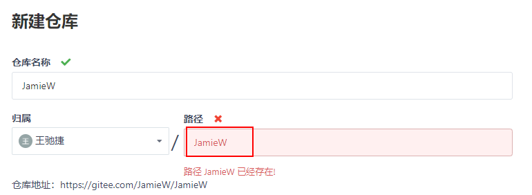

因为我已经创建过了，所以存在，下方的选项自己看情况勾选

### 3.同步

#### 1.复制仓库地址

复制仓库地址

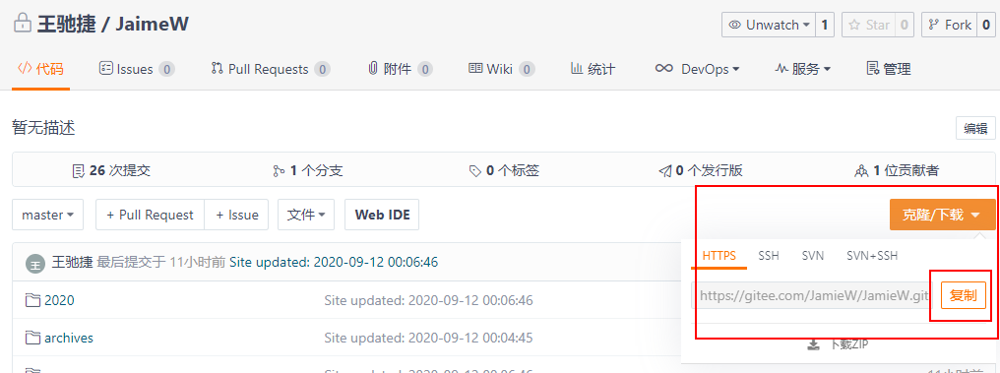

打开你刚刚创建hexo的地方，找到**_config.yml**这个文件，使用记事本或者说**sublime**打开

拉到最下面，将仓库地址填入repo关键字后面，注意冒号后面有一个空格，其余两个关键字跟我一样

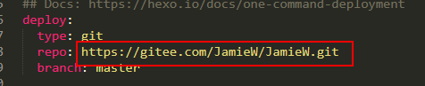

然后ctrl+F找到url，填写将来你生成出来的网站地址**https://yourId.gitee.io**, 只有严格按照上面仓库命名才可以噢！

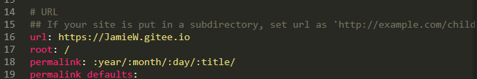

#### 2.同步

使用前面说的重新构建的命令

```
hexo clean
hexo g -d
```

这个时候会要求你输入gitee的账号密码，输入之后即可上传到你所创建的仓库内

配置**ssh密钥**可以免密码输入，具体百度，本文不过多介绍

#### 3.部署Gitee Pages

点击

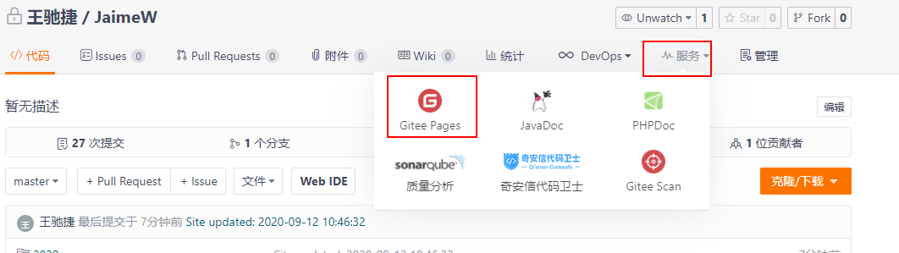

勾选强制使用https

点击**部署or更新**

注意，以后每一次上传完文章都要来这里点击更新（这个是相对于github不好的地方，可是谁叫它加载快呢！只能是含泪接受它的缺点了）

### 4.体验

在地址栏输入 yourGiteeName.gitee.io即可访问你的hexo博客啦！

## 2.github

### 1.注册账号

自己操作

### 2.创建仓库

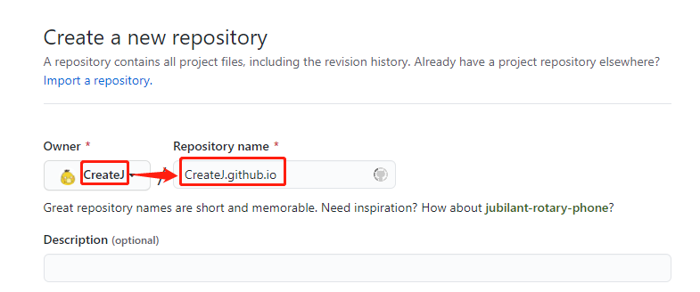

命名要跟自己的用户名一样，才能开启github page，一定要按照这个规则来噢！

### 3.同步

#### 1.复制仓库地址

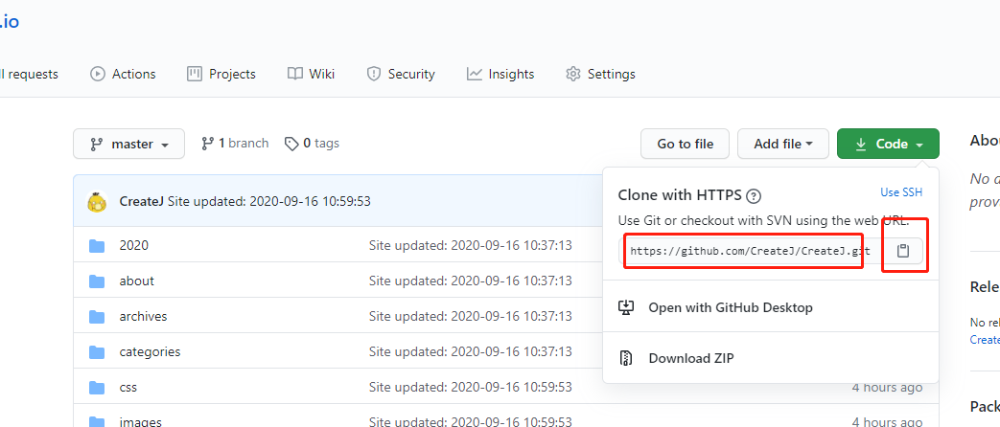


#### 2.同步

将地址以下图形式粘贴到**_config.yml**文件中，并补充相应的内容

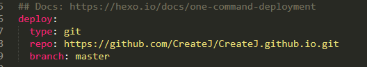

然后将https://yourGithubName.github.io粘贴到以下位置

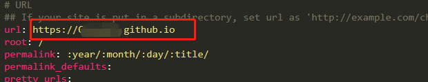

#### 3.部署到github page

保存_config.yml文件

执行

```
hexo clean
hexo g -d
```

部署这一步是github自动的，比gitee要优秀的多

### 4.体验

这个时候在地址栏输入yourGithubName.github.io即可访问你的hexo博客啦！


# Github.io访问被拒解决方法（逐步更新）

## 1.修改host文件

一般在路径**C:\Windows\System32\drivers\etc**下，正常情况下没办法直接修改host文件，可以复制出来，然后修改完在复制回去，然后确认管理员权限即可

### 1.[点击这里](https://github.com.ipaddress.com/)跳转查看**github.com**的ip地址

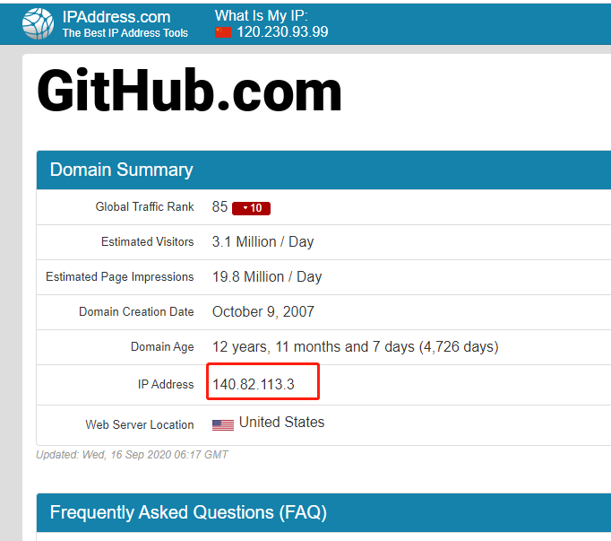

### 2.[点击这里](https://fastly.net.ipaddress.com/github.global.ssl.fastly.net)查看**github.global.ssl.fastly.net**的ip地址

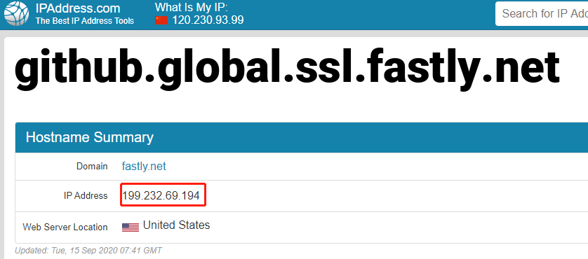

### 3.[点击这里](https://github.com.ipaddress.com/assets-cdn.github.com)查看github.io的ip地址

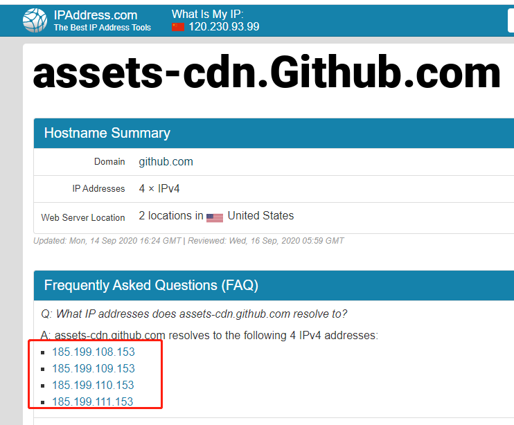

最后，按照以下格式添加到host文件的最后面

```
140.82.114.3 github.com
199.232.69.194 github.global.ssl.fastly.net

185.199.108.153 github.github.io
185.199.109.153 github.github.io
185.199.110.153 github.github.io
185.199.111.153 github.github.io
```

## 2.修改DNS地址

将ipv4协议的DNS解析地址修改为114.114.114.114