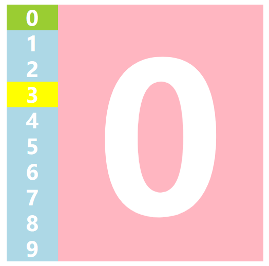
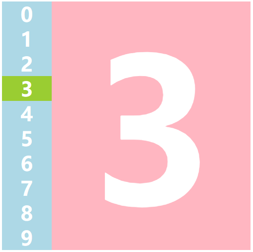
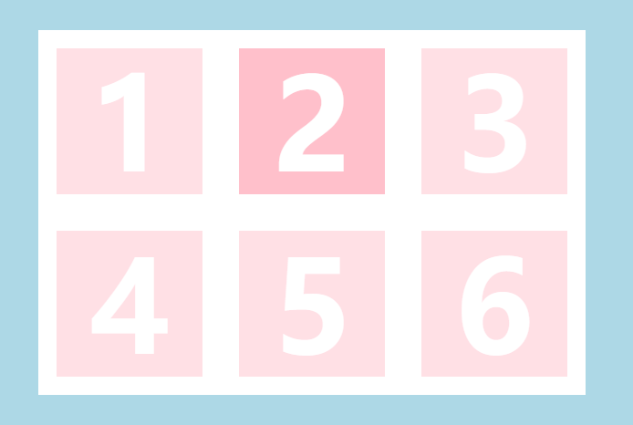
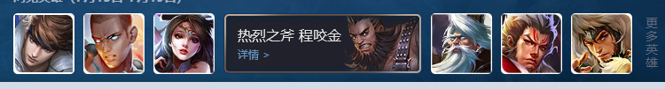
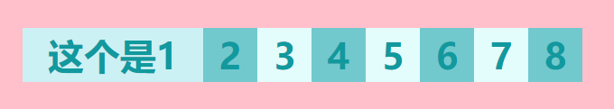
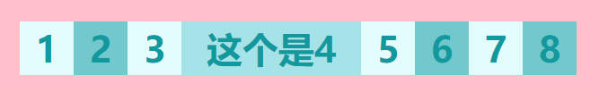

# jQuery：1.基础

jQuery是一个封装好的js库，目的是让你‘写得更少，做得更多’。

## 1.jQuery选择器

**基础选择器**

```javascript
$('选择器') 	// 格式，单引号双引号都行
```

**几个容易忘记的选择器**

```javascript
$('div,p,li') 	// 并集选择器
$('li.current') // 交集选择器
$('ul>li')		// 子代选择器，tips：只会选择亲儿子，孙子辈的不会被选择
$('ul li')		// 后代选择器
```

**筛选选择器**

```javascript
$('li:first')	// 获取第一个li元素
$('li:last')	// 最后一个
$('li:eq(2)')	// 索引号为2的元素
$('li:odd')		// 奇数
$('li:even')	// 偶数
```

**筛选方法（重点）**

```javascript
$('li').parent()				// 查找父级
$('ul').children('li')			// 相当于$('ul>li')
$('ul').find('li')				// 相当于$('ul li')
$('.first').siblings('li')		// 查找兄弟
$('.first').nextAll()			// 查找当前元素之后的所有兄弟
$('.last').preAll()				// 查找当前元素之前的所有兄弟
$('div').hasClass('protected')	// 查找包含特定的类的元素
$('li').eq(2)					// 相当于$('li:eq(2)')
```

**排他思想实现**

```html
<!--html-->
<button>Button</button>
<button>Button</button>
<button>Button</button>
```

```javascript
//js
<script>
    $('button').click(function () {
        $(this).css('background-color','pink');
        $(this).siblings('button').css('background-color','');
    });
</script>
```

**tips**: jquery自带隐式迭代

### 1.淘宝购物服饰精选(排他思想实现)

```html
<!--css略-->
<!--html部分代码-->
<div class="box">
    <div class="left">
        <ul>
            <li>0</li>
            <!--省略1-8-->
            <li>9</li>
        </ul>
    </div>
    <div class="right">
        <div>0</div>
        <!--省略1-8-->
        <div>9</div>
    </div>
</div>
<!--js部分代码-->
<script>
    $(function () {
        //默认显示第一个元素
        $('.right>div').eq(0).show();
        $('.left ul li').click(function () {
            // 高亮选中，恢复其他
            $(this).css('background-color','yellowgreen');
            $(this).siblings().css('background-color','');
            // 获取选中的小标，用于选中展示哪张图片
            var index = $(this).index();
            // 显示选中，隐藏其他
            $('.right>div').eq(index).show();
            $('.right>div').eq(index).siblings('div').hide();
        })
    })
</script>

<!--上方排他部分，可以缩减为-->
<script>
    $('.right>div').eq(index).show().siblings('div').hide();
</script>
```





## 2.jQuery样式修改

jq的css表达式**只有一个参数**时，**获取该参数的值**

```javascript
$('选择器').css('样式名');
// 例如某div的宽度为300px
console.log($('div').css('width'));
// 打印出来的值为300px
```

jq的css表达式有**两个参数**时，**修改第一个参数css的值为第二个参数**

```javascript
$('选择器').css('样式名',‘值’)
// 例如修改某div的宽度为300px
$('div').css('width',‘300px’)
// 等价于
var div = document.querySelector('div');
div.style.width = '300px';
// tips:当参数为数值时，可以不加单位，不加引号，但是尽量不要用
$('div').css('width',300);
```

一次性修改**多项参数**的时候，可以使用**对象**的写法

```javascript
$('div').css({
    'width': '400px',
    //参数为数值时可以省略引号和单位
    height: 400,
    backgroundColor: 'black'
    //注意这里符合属性要使用驼峰命名法
    //同时非数值型参数不可以省略引号
})
```

**类操作**（实例请查看购物车修改商品背景部分）

```javascript
$('选择器').addClass('css类名');    	// 添加类
$('选择器').removeClass('css类名');	// 删除类
$('选择器').toggleClass('css类名');	// 切换类 添加删除集合在一起
```

**tips**:  类名不要加点'.'，Class记得C大写


## 3.jQuery效果API

1. 下滑上滑（下拉菜单实例）

   ```javascript
   $('选择器').slideDown(500,swing,fn);		// 下滑
   $('选择器').slideUp(500,swing,fn);			// 上滑
   $('选择器').slideToggle(500,swing,fn);		// 切换滑动
   ```

2. 淡入淡出（图片聚焦实例）

   ```javascript
   fadeIn([s],[e],[fn])		//淡入
   fadeOut([s],[e],[fn])		//淡出
   fadeTo([[s],o,[e],[fn]])	//调整透明度
   fadeToggle([s,[e],[fn]])	//切换淡入淡出
   ```

3. 自定义动画

   ```
   animate(params,[speed],[easing],[fn])
   ```

   **tips**：params需要以对象的形式传入

### 1.下拉菜单更加简便的写法(hover())

```html
<!--原版-->
<!--没有动画效果，需要定义两个动作-->
<script>
    $(function () {
        $('body>ul>li').mouseover(function () {
            $(this).children('ul').show();
        });
        $('body>ul>li').mouseleave(function () {
            $(this).children('ul').hide();
        });
    });
</script>
<!--新版-->
<!--更加简洁好理解-->
<script>
    $(function () {
        $('body>ul>li').hover(function () {
            $(this).children('ul').slideDown();
        },function f() {
            $(this).children('ul').slideUp();
        })
    });
</script>
<!--高级缩减版-->
<!--非常简洁-->
<script>
    $(function () {
        $('body>ul>li').hover(function () {
            $(this).children('ul').slideToggle();
        })
    });
</script>
<!--升级缩减版-->
<!--防止出现动画排队的情况-->
<script>
    $(function () {
        $('body>ul>li').hover(function () {
            $(this).children('ul').stop().slideToggle();
        })
    });
</script>
```

### 2.图片焦点聚集实例

**原理**：将选中的图片的兄弟透明度变为0.5

```javascript
<!--css和html略-->
<script>
    $(function () {
        $('.box div').hover(function () {
            $(this).siblings('div').stop().fadeTo(500,0.5)
        },function () {
            $(this).siblings('div').stop().fadeTo(500,1);
        })
    })
</script>
```

**效果图**



### 3.手风琴效果简单实现







```html
<!--html部分代码-->
<ul>
    <li class="odd">
        <div class="big odd">这个是1</div>
        <div class="small odd">1</div>
    </li>
    <!--中间以奇偶排列增加6个li，略-->
    <li class="even">
        <div class="big odd">这个是8</div>
        <div class="small odd">8</div>
    </li>
</ul>
```

```css
/*css部分代码*/
        li>div{
            color: #11999e;
            font-weight: bolder;
            font-size: 40px;
            line-height: 60px;
        }
        ul {
            width: 620px;
            height: 60px;
            margin: 200px auto;
        }
        li {
            float: left;
            width: 60px;
            height: 60px;
        }
        .big {
            display: none;
            height: 60px;
            width: 200px;
            text-align: center;
        }
        .small {
            display: inline-block;
            height: 60px;
            width: 60px;
            text-align: center;
        }
        .odd .big {
            background-color: #cbf1f5;
        }
        .odd .small{
            background-color: #e3fdfd;
        }
        .even .big {
            background-color: #a6e3e9;
        }
        .even .small{
            background-color: #71c9ce;
        }
```

```javascript
//js完整代码
$(function () {
    $('li').eq(0).css('width','200px');
    $('li').eq(0).children('.big').show();
    $('li').eq(0).children('.small').hide();

    $('li').mouseover(function () {
        // 将其他兄弟的宽度全部恢复成60px
        $(this).siblings('li').stop().animate({'width':'60px',},500);
        // 将自己的宽度变成200px
        $(this).stop().animate({'width':'200px',},500);
        // 将自己的子节点big淡入，small淡出
        $(this).children('.big').stop().fadeIn('fast').siblings('.small').stop().fadeOut('fast');
        // 将其他兄弟的子节点big淡，small淡入
        $(this).siblings('li').children('.big').stop().fadeOut('fast').siblings('.small').stop().fadeIn('fast');
    })
})
```

## 4.jQuery获取属性

1. 获取元素固有属性

   ```javascript
   // 获取
   $('选择器').prop('属性');
   // 修改
   $('选择器').prop('属性','值');
   ```

2. 获取元素的自定义属性

   ```javascript
   // 获取
   $('选择器').attr('属性');
   // 修改
   $('选择器').attr('属性','值');
   ```

   

## 5.jQuery获取文本值

1. 设置获取元素内容

   ```javascript
   // 获取
   $('选择器').html();	
   // 修改
   $('选择器').html('内容');		
   ```

2. 设置获取元素文本内容

   ```javascript
   // 获取
   $('选择器').text();
   // 修改
   $('选择器').text('内容');
   ```

3. 获取设置表单值

   ```javascript
   // 获取
   $('选择器').val();
   // 修改
   $('选择器').val('内容');
   ```


### 购物车功能

详情查看P058购物车案例

## 6.jQuery遍历元素

```javascript
$(element).each(function(index,element){
	// 遍历内容
    // index为当前循环的下标
    // element为当前选中的dom元素
    // 注意这里要使用需要转换成jQuery元素
})
```

## 7.jQuery创建元素

```javascript
var li = $('<li></li>');
```

## 8.jQuery添加与删除元素

```javascript
// 添加在该元素内部的最后
$('ul').append('<li></li>');
// 添加在该元素内部的最前
$('ul').prepend('<li></li>'first);

// 添加在兄弟元素的后面
$('.first').after('<div class='second'></div>');
// 添加在兄弟元素的前面
$('.second').after('<div class='first'></div>');

// 删除匹配到的元素
$('element').remove();
// 删除匹配到的元素的所有子元素（匹配到的元素没有删除）
$('element').empty();
$('element').html('');
```

# jQuery：2.事件操作

## 事件绑定

```javascript
$('ele').on(events[,select],fn);
```

**实例**

```javascript
		// 绑定单个事件
        $('div').on('mouseenter',function(){
            $(this).css('background-color','skyblue');
        })
		// 绑定多个事件，1.使用对象的形式
		$('div').on({
            mouseenter:function () {
                $(this).css('background-color','#95e1d3');
            },
            click:function () {
                $(this).css('background-color','#eaffd0');
            },
            mouseleave:function () {
                $(this).css('background-color','#fce38a');
            }
        })
		// 绑定多个事件，2.放在同一个参数中
		$('div').on('mouseenter mouseleave',function () {
            $(this).toggleClass('current');
        })
```

## 事件委派

```javascript
$('ele').on(events[,select],fn);

$('ul').on('click','li',function(){
	// tips：这里事件绑定的是ul元素，但是是用li触发的
})
```

**tips**：这里on可以给未来的元素绑定事件

## 事件解绑

```javascript
$('ele').off()						//解绑ele所有的事件处理
$('ele').off('click')				//解绑ele上的点击事件
$('ele').off('click','sonEle')		//解绑事件委托
```

**tips**:如果想让绑定的事件只执行一次，可以使用**one()**取代**on()**

## 自动触发事件

```javascript
$('ele').click()   				//模拟点击效果
$('ele').trigger('click') 		//效果等同
$('ele').triggerHandler('click')//效果等同，但不会触发元素的默认行为
```

## 事件对象

### 阻止冒泡

```html
<div class="parent">
  <div class="son"></div>
</div>
<script>
  $('.parent').on('click',function(){
    console.log('父盒子');
  })
  $('.son').on('click',function(event){
    console.log('子盒子');
    // 阻止事件冒泡
    event.stopPropagation();
  })
</script>
```

# jQuery：3.对象操作

```javascript
$.extend( [deep ], target, object1 [, objectN ] )
```

**tips：注意深浅拷贝的概念**

1. 浅拷贝：对于简单数据来说，深拷贝和浅拷贝都一样，会创建一个新的值。但是对于复杂数据如对象，会直接引用合并前的对象内容，所以修改新对象中的数据会影响到原对象的数据。
2. 深拷贝：会对对象中的每个数据都进行复制，遇到复杂数据也会重新创建一个一模一样的对象，而不是引用。

# jQuery：4.位置操作

1. **offset()**：获取设置文档的偏移值

   ```javascript
   $(ele).offset();		//获取偏移值
   $(ele).offset().top;	//获取顶部偏移值
   $(ele).offset({			//设置偏移值
   	top:200,
   	left:200
   });
   ```

   注意设置的时候要以对象的形式