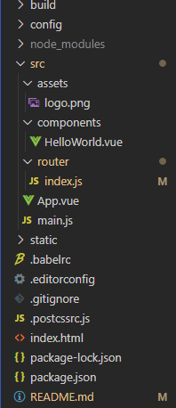

## 备注：

本文收录一些脚手架的配置信息，以及一些开发过程必要的操作

## 1.删除目录中不需要的资源



先把不必要的资源给删了

## 2.在compoments添加公共index.vue

```vue
<template>
  <div>
  	<h2>这里是index页面</h2>  
  </div>
</template>

<script>
export default {
  name: "",
  components: {},
  props: {},
  data() {
    return {
    };
  },
  watch: {},
  computed: {},
  methods: {},
  created() {},
  mounted() {}
};
</script>
<style scoped>

</style>
```

创建个人模板可以查看网上教程

## 3.配置vue-router

```javascript
import Vue from 'vue'
import Router from 'vue-router'

const Index=()=>import('../components/index')

Vue.use(Router)

export default new Router({
  routes: [
    {
      path: '',
      redirect: '/index',
    },
    {
      path: '/index',
      name: 'index',
      component: Index
    },
  ]
})
```

修改**app.vue**文件

```vue
<template>
  <div id="app">
    <router-view></router-view>
  </div>
</template>

<script>
import Index from './components/index'
export default {
  name: 'App',
  components: {
    Index
  }
}
</script>

<style>

</style>
```


## 4.安装vuex组件

在项目主目录运行

```
npm install vuex --save
```

在src目录下添加store文件夹，创建index.js文件

初始化以下内容

```javascript
import Vue from "vue";
import Vuex from "vuex";

Vue.use(Vuex);

const store = new Vuex.Store({
  state:{
    testInfo: '测试vuex'
  },
  mutations:{},
  getters:{},
  actions:{},
  modules:{}
})

export default store;
```

给**./compoments/index.vue** 的**tamplate**添加以下内容

```vue
<template>
  <div>
    <h2>-----这里是index页面-----</h2>
    <h2>-----vue测试-----</h2>
    <div>{{$store.state.testInfo}}</div>
  </div>
</template>
```

**main.js**修改为

```javascript
import Vue from "vue";
import App from "./App";
import router from "./router";
import store from './store';

Vue.config.productionTip = false;

new Vue({
  el: "#app",
  router,
  store,
  components: { App },
  template: "<App/>"
});
```

## 5.为文件夹添加别名

目的是为了在后期文件结构复杂的时候，可以快速定位到相应的文件夹

不用担心改一下文件位置就得修改大部分文件路径

在主目录下添加**vue.config.js**文件，初始化以下内容

```javascript
module.exports = {
  configureWebpack: {
    resolve: {
      alias: {
        //配置别名,修改后需要重新编译才能生效
        assets: "@/assets",
        components: "@/components",
        views: "@/views",
      },
    },
  },
};
```

## 6.添加公共css文件

在/assets/css文件夹中添加base.css

公共样式卸载里面

然后在main.js中引入

```javascript
require('./assets/css/base.css');
```

## 启动项目

```
npm run dev
```

打开网页

```
http://localhost:8080/#/index
```

